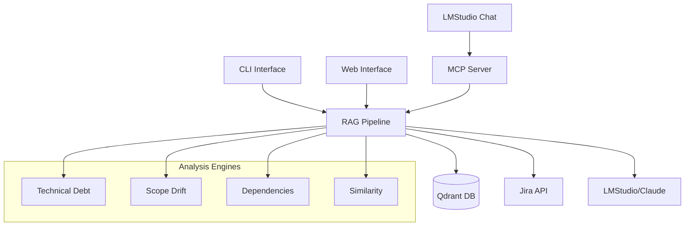

# JiraScope 🎯

AI-powered Jira work item analysis and management tool with RAG capabilities and LMStudio integration.

## ✨ Features

- **🔍 Semantic Search**: Natural language queries across Jira issues
- **📊 Technical Debt Analysis**: Automated identification and prioritization
- **🔄 Scope Drift Detection**: Epic requirement change tracking
- **🗺️ Dependency Mapping**: Cross-team blocker visualization
- **🤖 LMStudio Integration**: Local AI-powered analysis through MCP protocol
- **⚡ Real-time Processing**: Sub-second query responses
- **🛡️ Privacy-First**: All processing can run locally

## 🚀 Quick Start

### Option 1: LMStudio Integration (Recommended)

The easiest way to use JiraScope is through LMStudio's MCP integration:

```bash
# 1. Install JiraScope
pip install -e .

# 2. Run the setup wizard
python scripts/lmstudio_integration_setup.py

# 3. Follow the guided setup to configure LMStudio
# 4. Start chatting with your Jira data in natural language!
```

### Option 2: Direct CLI Usage

```bash
# Install dependencies
pip install -e .

# Set up configuration
cp config/jirascope.yaml.example config/jirascope.yaml
# Edit config/jirascope.yaml with your settings

# Run analysis
jirascope search "high priority bugs in authentication"
jirascope analyze-debt --component frontend
jirascope detect-drift --epic PROJ-123
```

## 🏗️ Architecture

JiraScope follows a modular architecture with multiple integration options:



## 🎯 Use Cases

### Sprint Planning
```
"Help me plan our next sprint. Analyze the mobile team's backlog and identify high-priority items and potential blockers."
```

### Technical Debt Management
```
"Find technical debt in our authentication system that should be addressed this quarter."
```

### Risk Assessment
```
"What risks should we consider for Epic PLATFORM-123? Look for dependencies and scope changes."
```

### Cross-Team Coordination
```
"Map dependencies between the frontend and backend teams for our Q2 release."
```

## 📋 Installation

### Prerequisites

- Python 3.11+
- [Qdrant](https://qdrant.tech/) vector database
- [LMStudio](https://lmstudio.ai/) (for local AI) or Claude API access
- Jira instance with API access

### Step-by-Step Setup

1. **Clone and Install**
   ```bash
   git clone https://github.com/yourusername/jirascope.git
   cd jirascope
   pip install -e .
   ```

2. **Start Vector Database**
   ```bash
   docker run -p 6333:6333 qdrant/qdrant
   ```

3. **Configure Environment**
   ```bash
   cp config/env.example .env
   # Edit .env with your Jira and LMStudio endpoints
   ```

4. **Set Up LMStudio Integration** (Recommended)
   ```bash
   python scripts/lmstudio_integration_setup.py
   ```

5. **Initial Data Processing**
   ```bash
   jirascope extract --jql "project = YOUR_PROJECT"
   jirascope process --batch-size 100
   ```

## 🛠️ Configuration

### Environment Variables

```bash
# Required
JIRA_MCP_ENDPOINT=https://your-jira.atlassian.net

# Optional (with defaults)
QDRANT_URL=http://localhost:6333
LMSTUDIO_ENDPOINT=http://localhost:1234/v1
CLAUDE_API_KEY=your_claude_key
```

### Configuration File

See `config/jirascope.yaml` for detailed configuration options including:
- Jira connection settings
- Vector database parameters
- Analysis thresholds
- Cost management

## 🔧 Usage

### LMStudio Integration

Once configured, simply chat with LMStudio using natural language:

- "Find high priority bugs from last week"
- "Analyze technical debt in payment processing"
- "Show me scope changes for Epic ABC-123"
- "What's blocking the mobile team?"

See `docs/examples/lmstudio_prompts.md` for comprehensive prompt patterns.

### CLI Commands

```bash
# Search and analysis
jirascope search "performance issues"
jirascope analyze-debt --team frontend --time-range "last month"
jirascope detect-drift --epic PROJ-123
jirascope map-deps --team mobile

# Data management
jirascope extract --jql "project = PROJ AND updated >= -7d"
jirascope process --incremental
jirascope validate --test-queries

# Server modes
jirascope mcp-server  # For LMStudio integration
jirascope web-server  # Web interface
```

## 🏛️ Project Structure

```
jirascope/
├── src/jirascope/           # Core application
│   ├── analysis/            # Analysis engines
│   ├── clients/            # External service clients
│   ├── extractors/         # Data extraction
│   ├── mcp_server/         # MCP protocol server
│   ├── pipeline/           # Processing pipeline
│   └── rag/               # RAG implementation
├── config/                 # Configuration files
├── scripts/               # Setup and utility scripts
├── docs/                  # Documentation and guides
│   └── examples/          # Usage examples and prompts
└── tests/                # Test suite
```

## 🧪 Testing & Coverage

JiraScope uses pytest with comprehensive test coverage tracking to ensure code quality and reliability.

### Running Tests

```bash
# Run all tests with coverage (recommended)
poetry run pytest

# Run specific test categories
poetry run pytest tests/unit/
poetry run pytest tests/integration/
poetry run pytest tests/test_rag_pipeline.py

# Run tests without coverage failure threshold
poetry run pytest --cov-fail-under=0

# Run tests with verbose output
poetry run pytest -v
```

### Test Coverage

The project maintains test coverage tracking with the following features:

- **Minimum Coverage**: 80% (configurable in `pyproject.toml`)
- **HTML Reports**: Interactive coverage reports in `htmlcov/`
- **Terminal Reports**: Shows missing lines directly in terminal
- **XML Reports**: Machine-readable reports for CI/CD integration

```bash
# View coverage in terminal
poetry run pytest --cov-report=term-missing

# Generate HTML coverage report
poetry run pytest --cov-report=html
open htmlcov/index.html  # View in browser

# Check coverage without running tests
poetry run coverage report
```

### Coverage Reports

After running tests, you'll find:

- **HTML Report**: `htmlcov/index.html` - Interactive web interface
- **XML Report**: `coverage.xml` - For CI/CD integration
- **Terminal Output**: Shows coverage percentages and missing lines

### Development Workflow

```bash
# 1. Install development dependencies
poetry install

# 2. Run tests before committing
poetry run pytest

# 3. Check coverage for new code
poetry run pytest --cov-report=html
open htmlcov/index.html

# 4. Test with real data
jirascope validate --test-queries config/test_queries.yaml
```

### Coverage Configuration

Test coverage is configured in `pyproject.toml`:

```toml
[tool.pytest.ini_options]
addopts = "--cov=src/jirascope --cov-report=html --cov-report=term-missing --cov-report=xml --cov-fail-under=80"

[tool.coverage.run]
source = ["src/jirascope"]
omit = ["*/tests/*", "*/test_*", "*/__pycache__/*"]
```

## 📚 Documentation

- **[CLI Usage Guide](docs/CLI_USAGE.md)** - Command-line interface reference
- **[Web Interface Guide](docs/WEB_USAGE.md)** - Browser-based usage
- **[LMStudio Prompts](docs/examples/lmstudio_prompts.md)** - Natural language patterns
- **[Phase Summaries](docs/PHASE*_SUMMARY.md)** - Development history

## 🔄 Development Phases

- ✅ **Phase 1**: Enhanced Vector Storage & Retrieval
- ✅ **Phase 2**: Advanced RAG Pipeline
- ✅ **Phase 3**: MCP Server Implementation
- ✅ **Phase 4**: LMStudio Integration
- 🚧 **Phase 5**: Advanced Analytics (planned)

## 🤝 Contributing

1. Fork the repository
2. Create a feature branch
3. Make your changes
4. Add tests
5. Submit a pull request

## 📄 License

This project is licensed under the MIT License - see the LICENSE file for details.

## 🙏 Acknowledgments

- [Anthropic](https://www.anthropic.com/) for the Model Context Protocol
- [LMStudio](https://lmstudio.ai/) for local AI capabilities
- [Qdrant](https://qdrant.tech/) for vector search
- The open-source community for various dependencies
