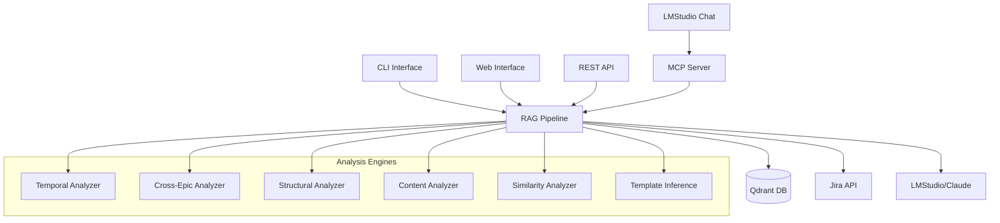

# JiraScope Documentation

Welcome to the JiraScope documentation! This is your central navigation point for all project documentation.

## 📚 Quick Navigation

### Getting Started
- [🏠 **Main README**](../README.md) - Project overview, features, and quick start
- [⚡ **Quick Setup Guide**](#quick-setup) - Get up and running in 5 minutes
- [🔧 **Configuration Guide**](#configuration) - Detailed configuration options

### User Guides
- [💻 **CLI Usage Guide**](CLI_USAGE.md) - Command-line interface reference
- [🌐 **Web Interface Guide**](WEB_USAGE.md) - Browser-based usage and features
- [🤖 **LMStudio Integration**](examples/lmstudio_prompts.md) - Natural language interaction patterns

### Technical Documentation
- [🏗️ **API Documentation**](api/README.md) - REST API endpoints and SDKs
- [🧪 **Testing Guide**](../tests/README.md) - Test structure and execution
- [📊 **Test Quality Analysis**](test-integrity-analysis.md) - Test improvement recommendations

### Development & Maintenance
- [🛠️ **Development Guide**](development-guide.md) - Comprehensive development setup and standards
- [🔍 **Linting Guide**](LINTING.md) - Code quality and formatting standards
- [📈 **Phase 5 Summary**](PHASE5_SUMMARY.md) - Advanced analytics features
- [🎯 **MVP Requirements**](MVP.md) - Minimum viable product definition

### Project History
- [📝 **Changelog**](../CHANGELOG.md) - Version history and changes
- [📊 **Phase Summaries**](#phase-documentation) - Development phase overviews

---

## 📋 Documentation Overview

### 🏁 Quick Setup

**Prerequisites**: Python 3.11+, Docker (for Qdrant)

```bash
# 1. Install JiraScope
pip install -e .

# 2. Start vector database
docker run -p 6333:6333 qdrant/qdrant

# 3. Configure environment
cp config/env.example .env
# Edit .env with your settings

# 4. Run setup wizard (recommended)
python scripts/lmstudio_integration_setup.py
```

**Next Steps**: See [CLI Usage Guide](CLI_USAGE.md) or [Web Interface Guide](WEB_USAGE.md)

### ⚙️ Configuration

JiraScope supports multiple configuration methods:

#### Environment Variables (.env)
```bash
# Copy template and customize
cp config/env.example .env
```
**Best for**: Development, Docker deployments

#### YAML Configuration
```bash
# Copy template and customize
cp config/jirascope.yaml.example config/jirascope.yaml
```
**Best for**: Production, complex configurations

**Reference**: See [config/env.example](../config/env.example) for all available options

### 🎯 Core Features

| Feature | Description | Documentation |
|---------|-------------|---------------|
| **🔍 Semantic Search** | Natural language queries across Jira issues | [CLI](CLI_USAGE.md#search--query), [API](api/README.md#search-endpoints) |
| **📊 Technical Debt Analysis** | Automated identification and prioritization | [CLI](CLI_USAGE.md#analysis-commands), [Phase 5](PHASE5_SUMMARY.md) |
| **🔄 Scope Drift Detection** | Epic requirement change tracking | [Analysis Features](PHASE5_SUMMARY.md#analysis-modules) |
| **🗺️ Dependency Mapping** | Cross-team blocker visualization | [Cross-Epic Analysis](PHASE5_SUMMARY.md#2-cross-epic-analyzer) |
| **🤖 LMStudio Integration** | Local AI-powered analysis through MCP | [LMStudio Guide](examples/lmstudio_prompts.md) |
| **⚡ Real-time Processing** | Sub-second query responses | [Performance](../README.md#testing--coverage) |

### 🏗️ Architecture Overview



### 📖 Usage Patterns

#### For Developers
1. **Daily Analysis**: [CLI commands](CLI_USAGE.md#daily-analysis) for incremental data sync and duplicate detection
2. **Code Quality**: [Test integrity analysis](test-integrity-analysis.md) and improvement recommendations
3. **Integration**: [API endpoints](api/README.md) for custom tool integration

#### For Project Managers
1. **Sprint Planning**: [Web interface](WEB_USAGE.md#sprint-planning-workflow) for capacity and risk analysis
2. **Progress Tracking**: [Temporal analysis](PHASE5_SUMMARY.md#1-temporal-analyzer) for velocity and trend monitoring
3. **Risk Assessment**: [Cross-epic analysis](PHASE5_SUMMARY.md#2-cross-epic-analyzer) for scope and dependency risks

#### For Teams
1. **Natural Language Queries**: [LMStudio integration](examples/lmstudio_prompts.md) for conversational analysis
2. **Automated Reports**: [Phase 5 features](PHASE5_SUMMARY.md#automated-intelligence-reports) for regular insights
3. **Knowledge Sharing**: [Template inference](PHASE5_SUMMARY.md#6-template-inference-engine) for best practice capture

### 🧪 Testing & Quality

| Test Category | Purpose | Documentation |
|---------------|---------|---------------|
| **Unit Tests** | Component isolation testing | [Test Structure](../tests/README.md#unit-tests) |
| **Integration Tests** | Component interaction testing | [Test Structure](../tests/README.md#integration-tests) |
| **Functional Tests** | User-facing feature testing | [Test Structure](../tests/README.md#functional-tests) |
| **Performance Tests** | Scalability and performance | [Test Structure](../tests/README.md#performance-tests) |

**Quality Standards**: See [Test Integrity Analysis](test-integrity-analysis.md) for improvement guidelines

### 📊 Phase Documentation

The project evolved through several phases, each building upon the previous:

| Phase | Focus | Key Features | Documentation |
|-------|-------|--------------|---------------|
| **Phase 1** | Vector Storage & Retrieval | Basic search, Qdrant integration | Foundation |
| **Phase 2** | Advanced RAG Pipeline | Context assembly, quality validation | RAG Enhancement |
| **Phase 3** | MCP Server Implementation | LMStudio protocol, real-time queries | MCP Integration |
| **Phase 4** | LMStudio Integration | Natural language interface, setup automation | User Experience |
| **Phase 5** | Advanced Analytics | Predictive insights, automated intelligence | [Phase 5 Summary](PHASE5_SUMMARY.md) |

### 🔧 Development Tools

| Tool | Purpose | Configuration |
|------|---------|---------------|
| **Poetry** | Dependency management | [pyproject.toml](../pyproject.toml) |
| **MyPy** | Type checking | [pyproject.toml](../pyproject.toml) |
| **Pytest** | Testing framework | [Test Guide](../tests/README.md) |
| **Pre-commit** | Code quality hooks | [.pre-commit-config.yaml](../.pre-commit-config.yaml) |
| **Docker** | Containerization | [Dockerfile](../Dockerfile), [docker-compose.yml](../docker-compose.yml) |

### 📞 Support & Troubleshooting

#### Common Issues
- **Connection Errors**: Check [health commands](CLI_USAGE.md#health-check)
- **Authentication**: See [auth troubleshooting](CLI_USAGE.md#authentication)
- **Performance**: Review [optimization guide](CLI_USAGE.md#cost-optimization)

#### Getting Help
1. **Check Documentation**: Use this index to find relevant guides
2. **Review Examples**: See [LMStudio prompts](examples/lmstudio_prompts.md) for usage patterns
3. **Test Environment**: Run [validation commands](CLI_USAGE.md#maintenance)

### 🔄 Contributing

1. **Code Quality**: Follow [linting standards](LINTING.md)
2. **Testing**: Add tests following [test structure](../tests/README.md)
3. **Documentation**: Update relevant guides when adding features

---

## 📝 Documentation Status

| Document | Status | Last Updated | Completeness |
|----------|--------|--------------|--------------|
| [Main README](../README.md) | ✅ Current | Latest | 95% |
| [CLI Usage](CLI_USAGE.md) | ✅ Current | Latest | 90% |
| [Web Interface](WEB_USAGE.md) | ✅ Current | Latest | 85% |
| [API Documentation](api/README.md) | ✅ New | Latest | 100% |
| [Development Guide](development-guide.md) | ✅ New | Latest | 100% |
| [LMStudio Guide](examples/lmstudio_prompts.md) | ✅ Current | Latest | 90% |
| [Test Guide](../tests/README.md) | ✅ Current | Latest | 95% |
| [Phase 5 Summary](PHASE5_SUMMARY.md) | ✅ Current | Latest | 100% |

---

**Quick Links**: [🏠 Home](../README.md) | [💻 CLI](CLI_USAGE.md) | [🌐 Web](WEB_USAGE.md) | [🤖 LMStudio](examples/lmstudio_prompts.md) | [🔧 API](api/README.md)
